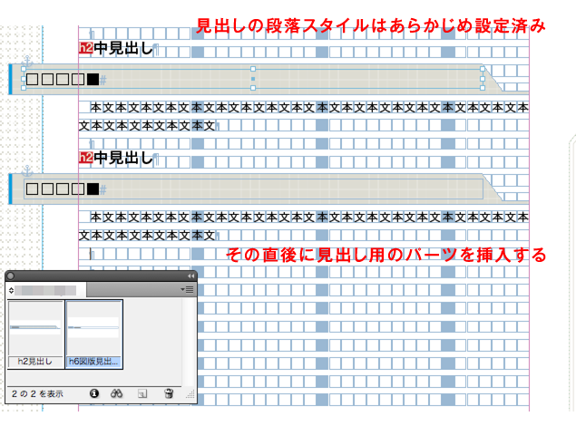
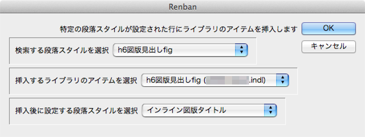

# seachPStyleAndInsertAsset
InDesign用のスクリプト。段落スタイルを検索してその部分にライブラリからアイテムを挿入する。

こういうことをしたいときに使います。

##使い方
1. 挿入したいパーツをライブラリに登録しておく（開いていないライブラリからは挿入できません）。
2. 検索を実行したいテキストフレーム内にカーソルを置いて、スクリプトを起動。
3. 検索したい段落スタイル、挿入したいアイテム、挿入後の段落に設定したいスタイルを選択して実行する。

4. 後は終わるまで待つ。

##メモ
findTextで検索した場所にasset.placeAssetで挿入していくのはいいのだけれど、
検索結果に昇順で挿入していくと検索位置がずれて、後のほうの結果がおかしくなってしまう。
逆順のforループで降順で挿入していく必要がある。

本当はアイテムを挿入した後、アイテム内にテキストを挿入するところまでやりたかったが、ずれを考えるとなかなか難しい。
